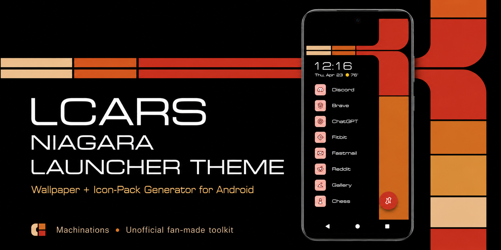
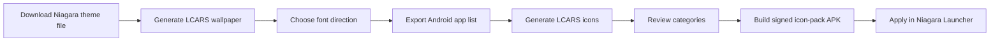

# LCARS Niagara Launcher Theme

<p align="center">
  
</p>

<p align="center">
  <b>Turn Niagara Launcher into a compact LCARS-style Android control panel.</b>
</p>

<p align="center">
  <a href="https://yearbook-enzyme.github.io/LCARS-Star-Trek-Niagara-Launcher-Theme/">
    
  </a>
  
  
  
</p>

An unofficial LCARS-inspired theme toolkit for **Niagara Launcher** on Android.

This project generates LCARS-style wallpapers, helps build matching Android/Niagara icon assets, links users to Trek-inspired font resources, and can produce a signed icon-pack APK that Niagara Launcher can recognize and apply.

It is built for people who want their phone to feel less like a normal app grid and more like a small, readable, information-dense control panel.

**Live site:**
https://yearbook-enzyme.github.io/LCARS-Star-Trek-Niagara-Launcher-Theme/

**Creator:** Logan / Machinations
https://blog.machinations.space/

---

## What this project does

The toolkit currently includes:

### LCARS Niagara theme file

Download the included Niagara theme file and import it into Niagara Launcher as the base layout.

### LCARS wallpaper generator

Generate LCARS-style wallpapers for phones, foldables, tablets, DAPs, e-readers, desktop/DeX layouts, ultrawide layouts, and custom exact resolutions.

The generator keeps the recognizable LCARS elbow shape while letting you tune the layout for your screen.

### Theme palettes

The wallpaper generator includes multiple color directions:

* Classic Warm LCARS
* TNG Pastel LCARS
* DS9 Muted Station
* Voyager Soft
* Command Gold
* Red Alert
* Security Red
* Science Blue/Purple
* Medical Teal
* Operations Blue
* Lower Decks Bright
* Latinum Gold
* Romulan Green
* Muted OLED
* Grayscale LCARS
* E-Ink Soft
* Terminal Green
* High Contrast

### Panel rhythm variations

The wallpaper generator also includes shape/rhythm variations that change the proportions of the static LCARS panels while preserving the main elbow structure:

* Standard LCARS stack
* Stepped color rhythm
* Tall lower panels
* Short accent blocks
* Balanced terminal blocks

These rhythms make the generator more flexible than a single fixed wallpaper template. They let the same LCARS shape language feel more dense, open, compact, balanced, or accent-heavy depending on the screen.

### Font guide

The project includes a font guide that links users to the Star Trek Minutiae font archive. Fonts are not bundled or redistributed by this project.

Recommended font roles include:

* **Federation** as the practical everyday launcher-label default.
* **Federation Wide** for broader display text.
* **Trek TNG Monitors** for a more console-accurate computer readout feel.
* **Context Ultra Condensed** and **Context Ultra Condensed Bold** for narrow LCARS labels.
* **Jefferies Extended**, **TOS Title**, and other title-style fonts for banners, lock screens, and display graphics.
* Alien-script fonts as decorative accents rather than normal launcher labels.

### Android app-list helper

The icon workflow works best with exact Android launcher components, not just package names.

For example:

```text
com.discord/com.discord.main.MainDefault
com.openai.chatgpt/com.openai.chatgpt.MainActivity
com.spotify.music/com.spotify.music.MainActivity
```

The included helper page provides ADB scripts for Linux/macOS/Git Bash and Windows PowerShell so users can export the correct launcher-component format from their own phone.

### LCARS icon generator

Paste or upload your Android launcher component list, parse the apps, review categories, and generate matching LCARS-style icon assets.

The icon generator includes:

* Theme-matched monochrome mode
* Theme palette by category
* Rainbow category mode
* 432×432, 512×512, and 1024×1024 PNG output
* ZIP export
* App category review table
* Local saved mappings
* Unknown-app JSON export
* Optional shared app-category contribution flow

### Signed APK builder

After parsing and reviewing an app list, the site can send a build request to the LCARS APK builder and return a signed Android icon-pack APK.

The generated APK is intended to be installed on Android and selected as an icon pack in Niagara Launcher.

---

## Project flow



---

## Quick start

1. Open the live site.
2. Download the included Niagara theme file.
3. Import the theme file into Niagara Launcher.
4. Generate and download an LCARS wallpaper for your device size.
5. Open the font guide and choose a readable Trek-inspired font direction.
6. Export your Android launcher component list using the app-list helper.
7. Paste or upload that component list into the icon generator.
8. Review app categories and adjust anything weird.
9. Download the icon ZIP or build the signed icon-pack APK.
10. Install the APK and apply it as an icon pack in Niagara Launcher.
11. Iterate on palette, rhythm, font, and icon mode until the setup feels right.

---

## Why exact Android components matter

For reliable icon replacement, the generator needs exact Android launcher components.

Correct format:

```text
com.discord/com.discord.main.MainDefault
com.openai.chatgpt/com.openai.chatgpt.MainActivity
com.spotify.music/com.spotify.music.MainActivity
```

Package-only lines like this are less reliable:

```text
com.discord
com.openai.chatgpt
com.spotify.music
```

A package name can identify the app, but an icon pack often needs the exact launchable activity too. Use the included app-list helper to export the full launcher component list.

---

## Privacy notes

The wallpaper generator runs locally in your browser.

The icon parser, category review table, preview icons, and icon ZIP export run locally in your browser.

Your app list is only sent to the APK builder when you choose to build a signed APK. App lists can reveal what apps you use, so avoid sharing them publicly if that matters to you.

Reviewed app/category mappings are only submitted if you choose to share them. These mappings help improve future automatic category guesses.

Fonts are not bundled, generated, or redistributed by this project. The font guide links to an external archive so users can choose and install fonts on their own device.

---

## Why LCARS?

LCARS was created in Star Trek as an interface for a civilization that seems to value coordination, clarity, and shared access to knowledge.

That is a big part of why I like it. It is not just a cool sci-fi look to me; it feels like a vision of technology that helps people interface with reality and with each other instead of trapping attention, burying everything under noise, or locking users into closed platforms.

This project is partly aesthetic, but it is also philosophical. It reflects a view of technology that feels more connected, more legible, more open, and more humane.

---

## Why Niagara Launcher?

Niagara Launcher already has a clean, vertical, information-dense layout.

LCARS also works best when the interface feels like a structured control surface instead of a normal app grid.

This project tries to make those two ideas fit together: Niagara provides the calm vertical launcher structure, and the LCARS theme adds the feeling of a readable command surface.

---

## Local development

Clone the repo:

```bash
git clone https://github.com/Yearbook-enzyme/LCARS-Star-Trek-Niagara-Launcher-Theme.git
cd LCARS-Star-Trek-Niagara-Launcher-Theme
```

Run the static site locally:

```bash
cd docs
python3 -m http.server 8000
```

Then open:

```text
http://localhost:8000/
```

---

## Project structure

```text
docs/
  index.html                    Wallpaper generator and theme-file download
  app.js                        Wallpaper generator logic
  icon-generator.html           Icon generator and APK builder UI
  icon-generator.js             Icon generator, category, ZIP, and APK logic
  get-app-list.html             Android launcher component export helper
  fonts.html                    Font guide and external font archive link
  about.html                    About, philosophy, credits, disclaimer
  style.css                     Main site styling
  ui-polish.css                 UI refinement styling
  ui-polish.js                  UI enhancement script
  assets/                       Social preview and README assets
  data/
    app-categories.json         Shared app/category mapping database
  downloads/
    export-lcars-app-list.sh    Linux/macOS/Git Bash ADB export helper
    export-lcars-app-list.ps1   Windows PowerShell ADB export helper
    *.nlt                       Niagara theme file

builder/
  android-template/             Android icon-pack template
  scripts/                      APK generation scripts
  input/                        Example build input

server/
  cpanel-builder/               PHP backend for APK building and mapping contributions

tools/
  import-contributions.js       Import reviewed app-category submissions

reports/
  app-category-import-*.md      Generated mapping import reports

MAINTENANCE.md                  Maintainer notes and recurring commands
```

---

## Maintenance

For maintenance notes, app-category imports, cPanel builder updates, cleanup, and release-tag commands, see:

```text
MAINTENANCE.md
```

Normal deploy flow:

```bash
cd ~/LCARS-Star-Trek-Niagara-Launcher-Theme
git status --short
git add .
git commit -m "Describe change"
git push
```

---

## Current status

Current milestone:

```text
v0.2.0
```

The project now has a working end-to-end path:

```text
Download Niagara theme file
→ generate wallpaper
→ choose font direction
→ export Android launcher component list
→ generate LCARS icons
→ review app categories
→ build signed APK
→ install APK
→ apply in Niagara Launcher
```

---

## Support

A donation/support link is not set up yet.

For now, the best place to follow future work is the Machinations blog:

https://blog.machinations.space/

---

## Disclaimer

This is an unofficial fan-made project.

It is not affiliated with Star Trek, Paramount, CBS, or Niagara Launcher.

Star Trek and related marks belong to their respective owners. Niagara Launcher belongs to its respective creators. This project is a personal interface experiment and theme toolkit.
