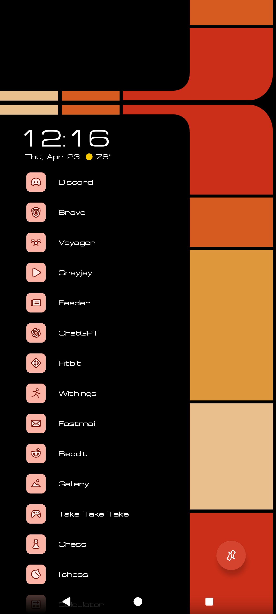

# LCARS Niagara Launcher Theme



An unofficial LCARS-inspired theme toolkit for **Niagara Launcher** on Android.

This project generates LCARS-style wallpapers, matching icon assets, and a signed Android icon-pack APK that can be applied in Niagara Launcher. It is built for people who like the Star Trek LCARS interface style and want a phone setup that feels more like a compact control panel than a normal app grid.

**Live site:**
https://yearbook-enzyme.github.io/LCARS-Star-Trek-Niagara-Launcher-Theme/

**Creator:** Logan / Machinations
https://blog.machinations.space/

---

## What this project does

The site currently includes:

* **LCARS wallpaper generator**
  Generate LCARS-style wallpapers for different phone/tablet sizes.

* **Android app-list helper**
  Export your exact Android launcher components using ADB so icons can map correctly.

* **LCARS icon generator**
  Paste or upload your launcher component list, review categories, and generate matching LCARS icon assets.

* **Signed icon-pack APK builder**
  Build a signed Android icon-pack APK that Niagara Launcher can recognize and apply.

* **Shared app-category improvement loop**
  Users can optionally submit app/category mappings. These can be reviewed and merged so future users get better automatic category guesses.

---

## Why LCARS?

LCARS was created in Star Trek as an interface for a civilization that seems to value coordination, clarity, and shared access to knowledge. That is a big part of why I like it. It is not just a cool sci-fi look to me; it feels like a vision of technology that helps people interface with reality and with each other instead of trapping attention, burying everything under noise, or locking users into closed platforms.

This project is partly aesthetic, but it is also philosophical. It reflects a view of technology that feels more connected, more legible, more open, and more humane.

---

## Why Niagara Launcher?

Niagara already has a clean, vertical, information-dense layout. LCARS also works best when the interface feels like a structured control surface instead of a normal app grid. This project tries to make those two ideas fit together.

---

## Quick start

1. Open the live site.
2. Generate and download an LCARS wallpaper.
3. Go to the app-list helper page.
4. Use the ADB helper script to export your Android launcher components.
5. Paste or upload that component list into the icon generator.
6. Review app categories.
7. Build the signed icon-pack APK.
8. Install the APK and apply it in Niagara Launcher.

---

## Important note about app lists

For reliable icon replacement, the generator needs exact Android launcher components, not just package names.

Correct format:

```text
com.discord/com.discord.main.MainDefault
com.openai.chatgpt/com.openai.chatgpt.MainActivity
com.spotify.music/com.spotify.music.MainActivity
```

Package-only lines like this are less reliable:

```text
com.discord
com.openai.chatgpt
com.spotify.music
```

Use the included ADB helper page/script to get the proper component list.

---

## Privacy notes

The wallpaper and icon preview tools run locally in your browser.

Your app list is only sent to the builder when you choose to build a signed APK. Category mapping contributions are only sent if you choose to submit them. App lists can reveal what apps you use, so avoid sharing them publicly if that matters to you.

---

## Local development

Clone the repo:

```bash
git clone https://github.com/Yearbook-enzyme/LCARS-Star-Trek-Niagara-Launcher-Theme.git
cd LCARS-Star-Trek-Niagara-Launcher-Theme
```

Run the static site locally:

```bash
cd docs
python3 -m http.server 8000
```

Then open:

```text
http://localhost:8000/
```

---

## Project structure

```text
docs/
  index.html              Wallpaper generator
  app.js                  Wallpaper generator logic
  icon-generator.html     Icon generator and APK builder UI
  icon-generator.js       Icon generator logic
  get-app-list.html       ADB export helper page
  style.css               Main site styling
  data/                   App category database
  downloads/              Helper scripts

builder/
  android-template/       Android icon-pack template
  scripts/                APK generation scripts
  input/                  Example build input

server/
  cpanel-builder/         PHP backend for cPanel/GitHub Actions builder

tools/
  import-contributions.js Import reviewed app-category submissions

MAINTENANCE.md            Maintainer notes and recurring commands
```

---

## Maintenance

For maintenance notes, app-category imports, cPanel builder updates, cleanup, and release-tag commands, see:

```text
MAINTENANCE.md
```

---

## Status

Current milestone:

```text
MVP v0.1.0
```

The full loop is working:

```text
Generate wallpaper
→ export Android launcher component list
→ generate icons
→ build signed APK
→ install APK
→ apply in Niagara Launcher
```

---

## Support

A donation/support link is not set up yet. For now, the best place to follow future work is the Machinations blog:

https://blog.machinations.space/

---

## Disclaimer

This is an unofficial fan-made project.

It is not affiliated with Star Trek, Paramount, CBS, or Niagara Launcher.
